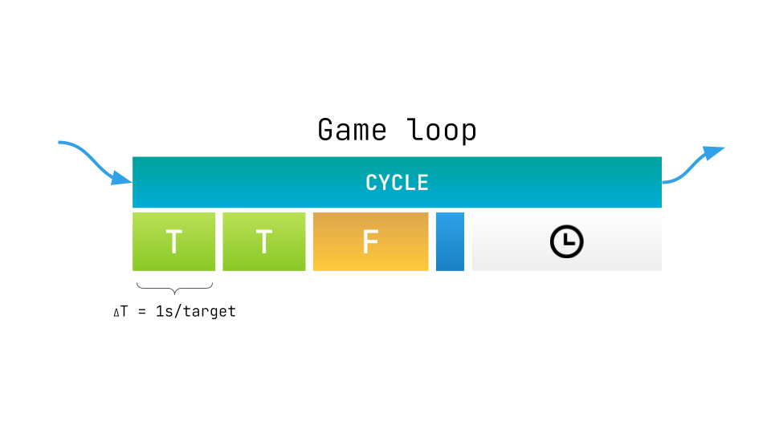
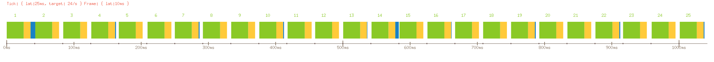

# go-glx / frames

Library for making endless game-loops, it`s heart of any game engine.



Game loop is endless loop:
```go
for {
  cycle()
}
```

Each __cycle__ contains 4 different steps:
- __Tick__ (fixed update logic). DeltaTime deterministic and always equal of `1s / targetTPS`. Cycle may have more than one tick, in case of lagging
- __Frame__ (draw function). Frame used for rendering game state. Count `frame` per `1s` is called `FPS`
- __Tasks__ task is any additional logic. Tasks will be executed, only when current cycle has free budget. Good example of __Task__ is __golang garbage collector__
- __Throttle__ not used time in current cycle. This is just __sleep__ call

## Deterministic cycles

Every update is deterministic, and deltaTime always fixed and same -
independent of hardware.

You can make any game state updates in `Tick` function
and draw game state in `Frame` function

## Base usage

Executor will run your `gameLoop` and automatic collect
and calculate all frame stats, also it will be throttle
processing, when CPU is more powerful than we need in `targetTPS`

```go
package main

import "github.com/fe3dback/glx-frames/frame"

func main() {
  executor := frame.NewExecutor(frame.WithTargetTPS(60))
  err := executor.Execute(ctx, update, draw)
  // ..
}

func update(st frame.TickStats) error {
  // player.velocity += player.acceleration * st.DeltaTime
  // player.position += player.velocity * st.DeltaTime

  time.Sleep(time.Millisecond * 10)
  return nil
}

func draw() error {
  // something like: 
  // renderer.Render(gameWorld)
  return nil
}
```

## Stats collector

Optionally stats collector can be used in `Executor`

Stats collector is just a function `func(s Stats)`.
This function will be executed right after each cycle end

```go
frame.NewExecutor(
  frame.WithTargetTPS(60),
  frame.WithStatsCollector(func(stats frame.Stats) {
    // do something with stats
  })
)
```

Stats object contain information about cycle execution and timings

```go
type Stats struct {
  // CycleID is number of game loop cycles since game start (this will auto inc to +1 every loop)
  CycleID uint64

  // target ticks per second (state fixed/physics update per second).
  // This is how many state updates game will have per second
  TargetTPS int

  // maximum calculated FPS that can be theoretically achieved in current CPU
  PossibleFPS int

  // Rate is always 1s / TargetTPS
  Rate time.Duration

  Game         Timings       // game loop timings
  Cycle        Timings       // current cycle timings
  Tick         Timings       // current tick timings
  Frame        Timings       // current frame timings
  Tasks        Timings       // current cycle running tasks timings
  ThrottleTime time.Duration // when CPU is more powerful when we need for processing at TargetTPS rate, frame will sleep ThrottleTime in end of current cycle

  CurrentTPS int // real counted ticks per second (ticks is fixed/physics update)
  CurrentFPS int // real counted frames per second
}

type Timings struct {
  Start    time.Time
  Duration time.Duration
}
```

## Tasks

You can provide some minor tasks, that will be executed
only when cycle have free CPU time.

For example at `targetTPS=60`, cycle capacity is `16.6ms`
When update/draw logic took `10ms`, we have free `6.6ms`

This `6.6ms` will be used for tasks processing

### GC task

Super useful and required in most cases is __garbage collection__
task, that will process golang GC only when we have free time.

Of course on low-end CPU's, when our `TPS` always less that `targetTPS`,
it will be executed anyway, at least once in `10 seconds`

```go
frame.NewExecutor(
  frame.WithTargetTPS(60),
  
  // add unlimited number of tasks
  frame.WithTask(
    frame.NewTask(
      func() {
        // try to run every frame
        // but not more often that once in 1s
        // but at least once in 10 second guaranteed
        runtime.GC()
        runtime.Gosched()
      },
      frame.WithRunAtLeastOnceIn(time.Second * 10),
      frame.WithRunAtMostOnceIn(time.Second),
      frame.WithPriority(TaskPriorityLow),
    ),
  ),
)

executor.Execute( .. )
```

Also it already defined in lib, you can use default task:

```go
frame.NewDefaultTaskGarbageCollect()
```

### Custom tasks

You can add any number of tasks, and choose priority from `LOW` to `HIGH`,
also `Executor` will take into account other task properties like `LastRunTime`, `AvgExecutionTime`
and other in priority calculation.

## Full Example

See code in [frame/executor_test](./frame/executor_test.go)

### Emulation settings

- TestTime = 1s
- TicksPerSecond = 24
- TickLatency = 25ms
- FrameLatency = 10ms 

Tasks:
- high priority 5ms task (run at least once in second, but try to every 500ms)
- low priority GC (at least once in second, but try to every 100ms)

### Output

Color mapping:
- green = tick (update)
- yellow = frame (draw)
- blue = tasks
- white = throttle (sleep)



#### This test also in text profile

```
| -- STATS --                     | -- Frame --                                          |
| elapsed | frame |  TPS  |  FPS  | capacity |   update |    frame |    tasks | throttle |
|  0042ms |  001  | 24/24 |   24  |     41ms |     25ms |     10ms |     06ms |     00ms |
|  0084ms |  002  | 24/24 |   24  |     41ms |     25ms |     10ms |     00ms |     05ms |
|  0125ms |  003  | 24/24 |   24  |     41ms |     25ms |     10ms |     00ms |     05ms |
|  0166ms |  004  | 24/24 |   24  |     41ms |     25ms |     10ms |     01ms |     04ms |
|  0209ms |  005  | 24/24 |   24  |     41ms |     25ms |     10ms |     00ms |     05ms |
|  0251ms |  006  | 24/24 |   24  |     41ms |     25ms |     10ms |     00ms |     05ms |
|  0292ms |  007  | 24/24 |   24  |     41ms |     25ms |     10ms |     00ms |     04ms |
|  0334ms |  008  | 24/24 |   24  |     41ms |     25ms |     10ms |     00ms |     05ms |
|  0375ms |  009  | 24/24 |   24  |     41ms |     25ms |     10ms |     00ms |     05ms |
|  0416ms |  010  | 24/24 |   24  |     41ms |     25ms |     10ms |     00ms |     05ms |
|  0459ms |  011  | 24/24 |   24  |     41ms |     25ms |     10ms |     00ms |     06ms |
|  0500ms |  012  | 24/24 |   24  |     41ms |     25ms |     10ms |     00ms |     05ms |
|  0542ms |  013  | 24/24 |   24  |     41ms |     25ms |     10ms |     00ms |     05ms |
|  0584ms |  014  | 24/24 |   24  |     41ms |     25ms |     10ms |     05ms |     00ms |
|  0626ms |  015  | 24/24 |   24  |     41ms |     25ms |     10ms |     00ms |     05ms |
|  0667ms |  016  | 24/24 |   24  |     41ms |     25ms |     10ms |     00ms |     04ms |
|  0709ms |  017  | 24/24 |   24  |     41ms |     25ms |     10ms |     00ms |     05ms |
|  0750ms |  018  | 24/24 |   24  |     41ms |     25ms |     10ms |     00ms |     05ms |
|  0792ms |  019  | 24/24 |   24  |     41ms |     25ms |     10ms |     00ms |     05ms |
|  0833ms |  020  | 24/24 |   24  |     41ms |     25ms |     10ms |     00ms |     05ms |
|  0875ms |  021  | 24/24 |   24  |     41ms |     25ms |     10ms |     00ms |     05ms |
|  0916ms |  022  | 24/24 |   24  |     41ms |     25ms |     10ms |     00ms |     04ms |
|  0958ms |  023  | 24/24 |   24  |     41ms |     25ms |     10ms |     00ms |     05ms |
|  1000ms |  024  | 24/24 |   24  |     41ms |     25ms |     10ms |     00ms |     05ms |
--- PASS: TestExecutor_Execute (1.00s)
```
